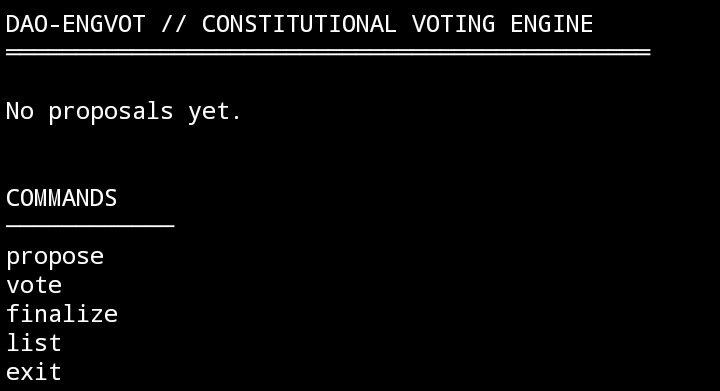

# 🏛 DAO-ENGVOT  
### Constitutional Voting Engine for Decentralized Governance

DAO-ENGVOT is a terminal-based constitutional voting engine designed to simulate structured DAO governance mechanisms.

This project demonstrates a clean CLI governance workflow including proposal creation, vote execution, finalization logic, and proposal state tracking.

Built as a modular fork within the Intercom ecosystem.

---

## ⚖️ Core Features

- 🗳 Proposal Creation System  
- ✅ Yes / No Voting Mechanism  
- 📊 Real-time Vote Percentage Calculation  
- 🔒 Proposal Finalization Logic (Approved / Rejected)  
- 📜 Status Tracking (Active / Approved / Rejected)  
- 🧭 Vertical Command Governance Layout  
- 🧱 Clean Constitutional CLI Structure  

---

## 🧠 Governance Flow

1. `propose` → Create new governance proposal  
2. `vote` → Cast YES / NO vote  
3. `finalize` → Close voting & determine outcome  
4. `list` → Display proposal dashboard  
5. `exit` → Shutdown governance engine  

---

## 🗳 Dashboard Voting Engine

Preview of DAO-ENGVOT running in CLI:



This preview demonstrates:

- Constitutional engine header layout
- Governance command structure
- Vertical command arrangement
- Proposal lifecycle system
- Clean DAO shutdown behavior

---

## 🏗 Architecture Overview

- Node.js ES Module Environment  
- Readline-based CLI Interaction  
- Crypto-based Proposal ID Generator  
- In-memory Proposal State Management  
- Vote Calculation Engine  
- Dynamic Status Resolution Logic  

---

## 🔍 Proposal Structure

Each proposal contains:

- Unique ID
- Title
- YES votes counter
- NO votes counter
- Status flag (ACTIVE / APPROVED / REJECTED)

Vote percentages are calculated dynamically during rendering.

---

## 🚀 Installation

Clone repository:

```bash
git clone https://github.com/anerto/dao-engvot.git
cd dao-engvot
```

Install dependencies:

```bash
npm install
```

Run engine:

```bash
node index.js
```

---

## 📁 Project Structure

```
dao-engvot/
│
├── index.js
├── package.json
├── README.md
├── SKILL.md
└── proof/
    └── dashboard-voting.jpg
```

---

## 🧩 Intercom Reference

This repository is a customized fork implementation inspired by the Intercom stack framework.

It extends the reference logic into a structured DAO governance simulation engine.

---

## 🛡 Governance Model

DAO-ENGVOT follows a simplified constitutional voting logic:

- Equal vote weight per participant
- Binary decision model (YES / NO)
- Majority-based approval
- Immutable finalization state

Designed for simulation and educational governance modeling.

---

## 💼 Use Case

- DAO Governance Simulation  
- CLI Governance Demo  
- Proposal Lifecycle Modeling  
- Voting System Architecture Example  
- Intercom Ecosystem Contribution  

---

## 📜 License

This project is released under an open governance simulation license.

You are free to use, modify, and extend this engine for educational or experimental DAO infrastructure purposes.

---

## 🔗 Trac Wallet

```
trac18c2luepg78slwylerag5tq38msvxxqtv0qxuadnd66fdl667r7nqv920vj
```

---

### DAO-ENGVOT  
Constitutional Structure • Transparent Voting • Modular Governance Engine
